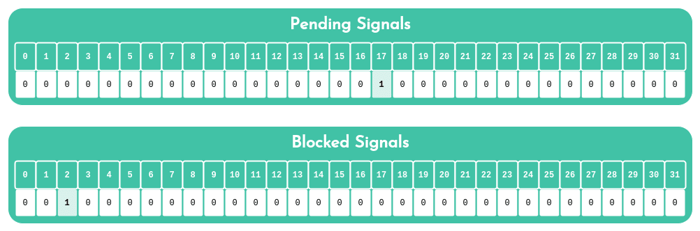

Write a blog post about signals

Your blog post should cover the following:

1. What is a signal?
    * Signals are triggers to certain behaviors like interrupting, quitting, error handling, etc...

2. Why do they exist?
    * Main functions need outside events so that the program will run efficiently.

3. When are they delivered and by whom?
    * They are delivered in condition or error handling if specified. If not its specified default action takes its place

4. What are the default actions of signals?
    * 1 - Abnormal termination
      2 - Ignore signal
      3 - Stop process
      4 - Continue if it's stopped at the moment; Otherwise ignore

5. What happens to a process when it receives a signal without handling it?
    * It will process the default action and most likely terminate it.

6. What happens to a process when it receives a signal and handles it?
    * The process will be suspended and the signal will then in turn be processed and handle the signal.

        The function for Printf is pretty simple to use, but throw in a signal like SIGINT and now you have a hijacked function till Ctrl-C is triggered by the user. It's not recommended to use printf in signal calls but its fun to use and learn. 
        
        SIGINTs default is 1, so it'll terminate. Otherwise it keeps running, unless condition is set.

Your posts should have examples and at least one picture, at the top. Publish your blog post on Medium or LinkedIn, and share it at least on LinkedIn.

When done, please add all urls below (blog post, tweet, etc.)

Please, remember that these blogs must be written in English to further your technical ability in a variety of settings.